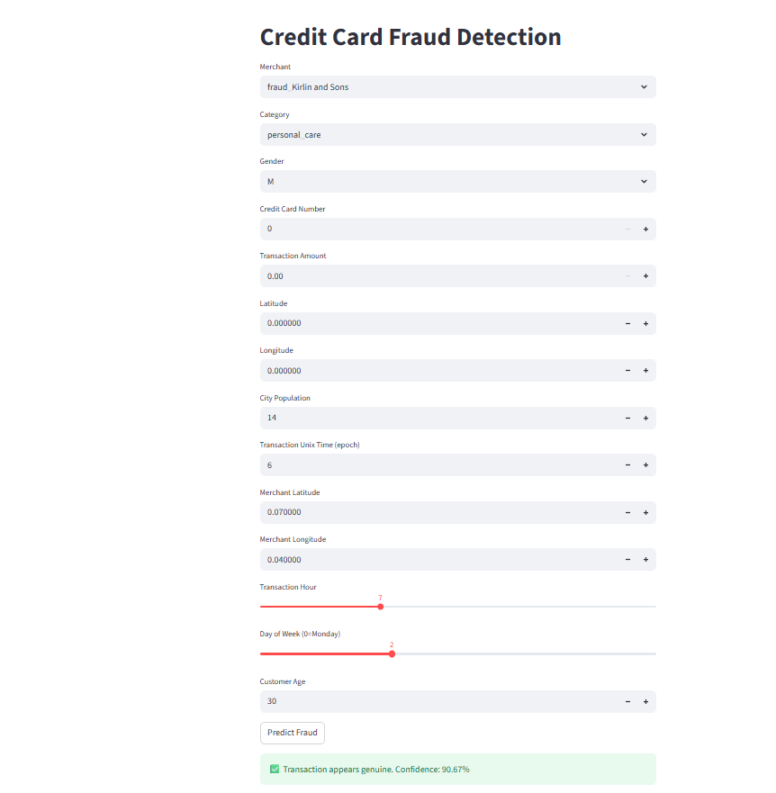
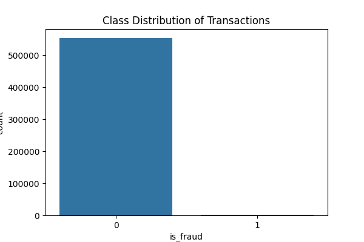
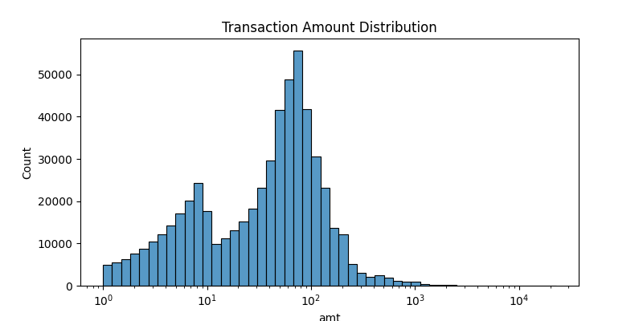
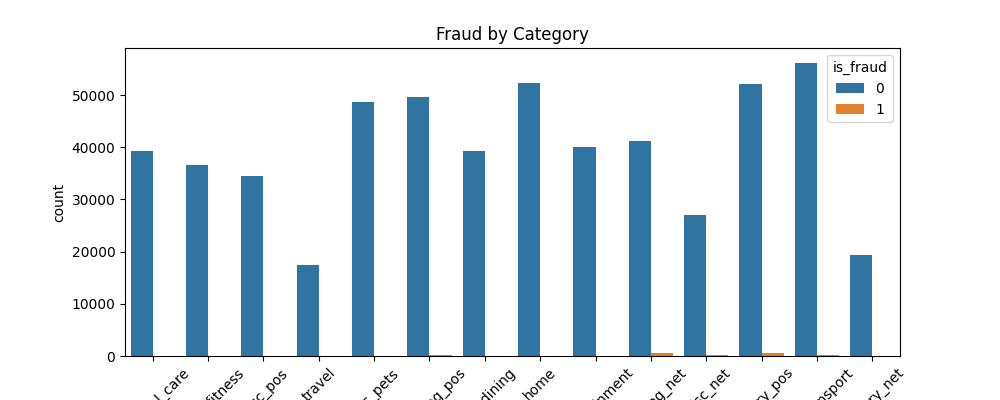
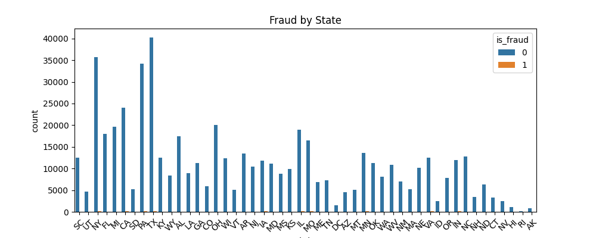
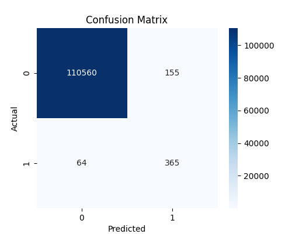
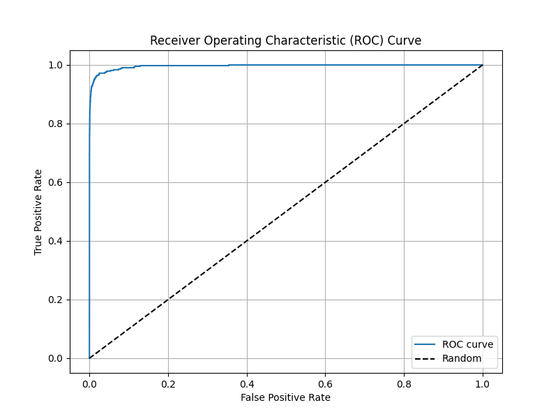

#  Credit Card Fraud Detection App

This project is a machine learning-based web application that detects fraudulent credit card transactions. It is built using Python, scikit-learn, XGBoost, and deployed via Streamlit.

---

## Features

- Trained on a dataset of real credit card transactions
- Supports multiple ML models: Random Forest, Logistic Regression, XGBoost
- Provides classification metrics: precision, recall, confusion matrix
- Streamlit-based web interface for predictions
- Easy deployment with GitHub integration

---

##  Live Demo

[Click here to try the app on Streamlit](https://creditcard-fraud-detection-model-9pzo5brcfwmxdmzsifwfva.streamlit.app/)

---

##  Project Structure

| File | Description |
|------|-------------|
| `app.py` | Streamlit frontend UI for real-time fraud detection |
| `main.py` | Prediction logic and model loader |
| `credit_card.py` | Training pipeline: data loading, EDA, model training, saving `.pkl` |
| `fraud_detection_pipeline.pkl` | Saved trained ML model |
| `fraudTest.csv` | Dataset used for training/testing the model |
| `requirements.txt` | All Python dependencies for the project |
| `.gitattributes` | Git settings for file handling |

---

##  How It Works

1. Load dataset from `fraudTest.csv`
2. Explore the data (EDA), handle class imbalance if any
3. Train models (RandomForest, LogisticRegression, XGBoost)
4. Save the best model as `fraud_detection_pipeline.pkl`
5. Use `main.py` to load the model and predict on new inputs
6. `app.py` provides a web interface using Streamlit

---

## Example Usage (CLI)

If you're testing locally:

```bash
python credit_card.py  # Trains the model
streamlit run app.py   # Launches the web app

## Model Performance

Update with actual metrics

Accuracy: 99%

Precision: 98%

Recall: 95%

## **Dataset**

The project uses a CSV file fraudTest.csv that contains anonymized credit card transaction data.

## Make sure the dataset is in the project root directory before running credit_card.py.

## **Credits**

Built by: Sujatha-Lab

Dataset Source: Kaggle - Credit Card Fraud Detection

##**Libraries Used:**

scikit-learn

xgboost

streamlit

pandas

joblib

## **Installation & Setup (Local)**

1. Clone the repository

```bash
git clone https://github.com/sujatha-lab/CreditCard-Fraud-Detection-Model.git
cd CreditCard-Fraud-Detection-Model

```

2.Create a virtual environment
```bash
python -m venv .venv
source .venv/bin/activate  # On Windows use: .venv\Scripts\activate

```
3.Install dependencies
```bash
pip install -r requirements.txt

```

4.Run the app
```bash
streamlit run app.py

```
## Notes

Ensure .venv/ is added to .gitignore

Do not commit sensitive data (real credit card info, if any)

Feel free to fork, modify, and enhance the project

##**License**

This project is for educational purposes. Feel free to use and modify it with credit.

## 🖼️ App Screenshot

Here is a preview of the Credit Card Fraud Detection app:


## 🧠 Model

This project tackles a **highly imbalanced dataset** (only ~0.38% fraud cases). To address this, we used **SMOTE** (Synthetic Minority Over-sampling Technique) during training to synthetically balance the class distribution.

We trained and evaluated the following classification models:

- **Logistic Regression**
- **Random Forest**
- **XGBoost**

Each model was optimized using `GridSearchCV` with cross-validation. The final model was selected based on **ROC-AUC**, **F1-score**, and **recall**, prioritizing fraud detection accuracy.

### 📈 Model Comparison (on Test Set)

| Metric      | Logistic Regression | Random Forest | XGBoost (Best) |
|-------------|---------------------|---------------|----------------|
| Accuracy    | 94.00%              | 99.89%        | **99.80%**     |
| Precision   | 5.00%               | 73.00%        | **70.19%**     |
| Recall      | 74.00%              | 76.00%        | **85.08%**     |
| F1-score    | 9.00%               | 75.00%        | **76.92%**     |
| ROC AUC     | 85.32%              | 98.87%        | **99.62%**     |

> 🏆 **Best Model**: XGBoost — selected for its high fraud recall and ROC-AUC.

---

## 📊 Model Evaluation Plots

Visual summaries of the model's performance and dataset insights.

---

### 📈 Class Distribution of Transactions
Shows class imbalance (fraud vs. genuine).
 

---

### 💰 Transaction Amount Distribution
Understanding how transaction amounts vary.


---

### 🛍️ Fraud by Category
Where fraud occurs based on merchant category.
  

---

### 🗺️ Fraud by State
Geographical view of fraudulent transactions.


--

### 📊 Confusion Matrix
True/false positives and negatives.
 

---

### 📉 ROC-AUC Curve
Model's ability to distinguish fraud from normal.
 

---

## 🧪 Example Usage (CLI)

Run locally with:

```bash
python credit_card.py        # Trains and saves model
streamlit run app.py         # Launches web app
```
---
### 🧪 Final Model Summary

- **Model Used**: XGBoost
- **ROC-AUC**: 99.62%
- **F1-score**: 76.92%
- **Trained With**: SMOTE + GridSearchCV
- **Saved Model**: `fraud_detection_pipeline.pkl`

The best model is integrated into the Streamlit app for real-time fraud prediction.
It outputs both the **predicted class** (fraud or not) and **fraud probability**.

---


> ✅ You can find all training code in `credit_card.py`, and the real-time prediction logic in `main.py` and `app.py`.
